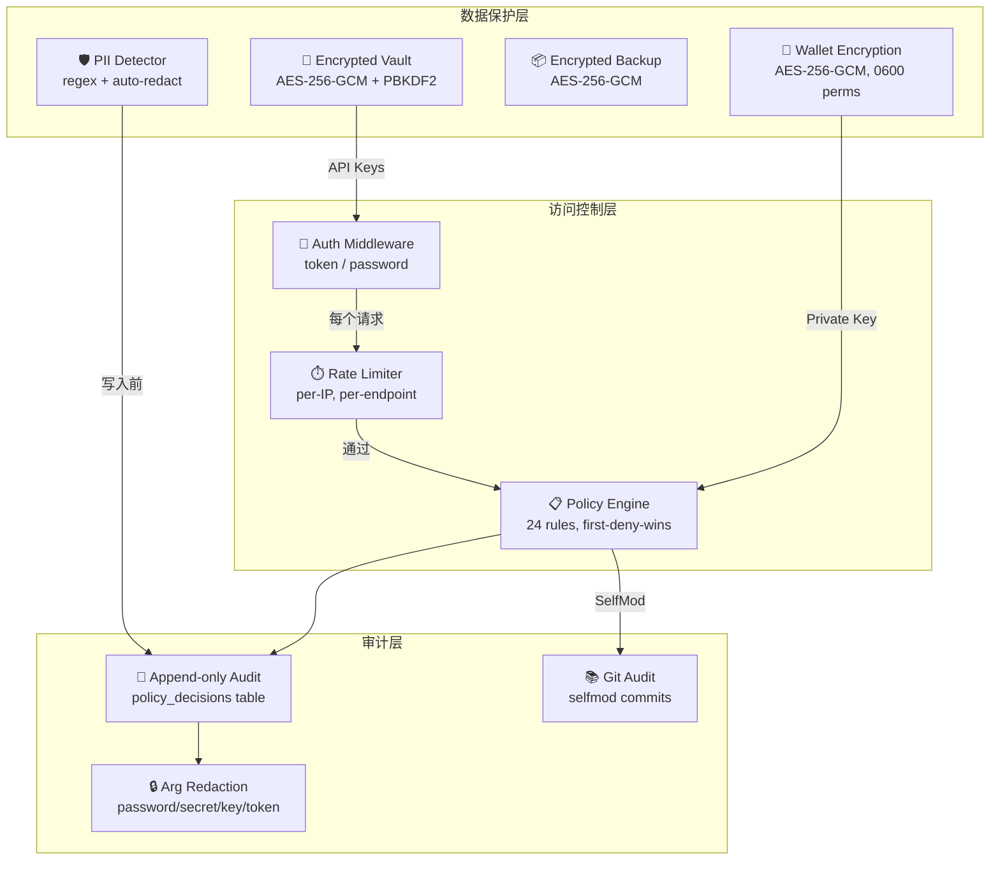

# Web4.0 Conway Automaton — 完整交付设计文档 v2

> **目标：** OpenClaw 功能对标 + Web4.ai 标准全面达成
>
> **约束：零额外付费 — 所有服务使用免费方案**

---

## 第一部分：OpenClaw 功能对标矩阵

### 核心架构对比

| OpenClaw 概念 | Web4.0 对应 | 状态 | 差距详情 |
|---|---|---|---|
| Gateway (WS Server) | `ws.ts` + `server.ts` | ✅ 已有 | 缺 auth modes |
| Agent Loop | `agent-loop.ts` (ReAct) | ✅ 已有 | — |
| Skills | `skills/loader.ts` | ✅ 已有 | 缺 CLI 管理命令 |
| Hooks / Plugins | — | ❌ 缺失 | 需新建 |
| Channels (Telegram/Discord) | — | ❌ 缺失 | 需新建 |
| Config (wizard + get/set) | `config.ts` + `.env` | ⚠️ 部分 | 缺交互式 wizard |
| Cron Scheduler | `heartbeat.ts` | ✅ 已有 | 缺 CLI 管理 |
| Memory (search/index) | 5-tier memory system | ✅ 已有 | 缺 CLI 搜索命令 |
| Browser (Playwright) | `browser-tools.ts` | ✅ 已有 | 缺 CLI expose |
| Models (discover/scan) | `model-discovery.ts` | ✅ 已有 | 缺 CLI 命令 |
| Agents (multi-agent) | `children.ts` | ⚠️ 部分 | 缺隔离工作区 |
| Backup | — | ❌ 缺失 | 需新建 |
| Doctor (health check) | heartbeat `health_check` | ⚠️ 部分 | 缺综合诊断 |
| Dashboard (Web UI) | 15 组件 dashboard | ✅ 已有 | 缺 static embed |
| TUI (Terminal UI) | `cli.ts` (Commander) | ⚠️ 部分 | 缺 TUI 模式 |
| Update (self-update) | — | ❌ 缺失 | 需新建 |
| Onboard (wizard) | — | ❌ 缺失 | 需新建 |

### OpenClaw CLI 命令完整对标

```
OpenClaw 命令                    Web4.0 现状        计划
─────────────────────────────────────────────────────────────
gateway start/stop/status        ✅ web4 start      添加 stop/restart
config get/set/validate          ⚠️ .env only       新建 web4 config *
configure (wizard)               ❌                  新建 web4 init
skills list/check/info           ✅ loader 存在      新建 web4 skills *
hooks list/install/enable        ❌                  新建 web4 plugins *
channels add/login/status        ❌                  新建 web4 channels *
cron add/edit/list/run           ✅ heartbeat 存在   新建 web4 cron *
memory search/index/status       ✅ repos 存在       新建 web4 memory *
browser start/screenshot/click   ✅ tools 存在       新建 web4 browser *
models discover/scan             ✅ discovery 存在   新建 web4 models *
agents add/list/bind             ⚠️ children 存在    新建 web4 agents *
backup create/verify             ❌                  新建 web4 backup
doctor                           ⚠️ health_check     新建 web4 doctor
dashboard                        ✅ 已有             加 static embed + open
tui                              ❌                  新建 web4 tui
update                           ❌                  新建 web4 update
status                           ✅ 已有             增强输出
chat                             ✅ 已有             —
fund                             ✅ 已有             —
onboard                          ❌                  新建 web4 onboard
```

---

## 第二部分：Web4.ai 标准设计层

Web4.ai 定义了超越 OpenClaw 的能力——**主权 AI agent 必须能自主生存、赚钱和进化。**

### 2.1 x402 支付层 — 自主赚钱

**OpenClaw 没有此能力。这是 Web4.0 的核心差异化。**

| 组件 | 现状 | 改动 |
|---|---|---|
| x402 Server (网关中间件) | ✅ 161 LOC，完整的 402→verify→settle 流程 | mock → onchain |
| x402 Client (发起付费请求) | ✅ 172 LOC | — |
| OnchainFacilitator | ❌ 缺失，目前用 MockFacilitator | 新建，接 Base Sepolia |
| OnchainWallet (USDC 余额查询) | ✅ 125 LOC，用 viem | — |
| LocalWallet (密钥管理) | ✅ 177 LOC | — |
| Paid API 端点 | ❌ x402Server 未挂载到 Express | 新建 /api/paid/* 路由 |
| Revenue Dashboard | ❌ FinancialCard 只显示余额 | 增加收入统计 |

**技术方案（零成本）：**

1. **新建 `onchain-facilitator.ts`**（~80 LOC）
   - 实现 `FacilitatorAdapter` 接口
   - `verify()`: 用 viem 查 Base Sepolia USDC Transfer 事件，确认金额+接收地址匹配
   - `settle()`: 确认交易 finality（Base Sepolia 约 2 秒）
   - 用 `publicClient.watchContractEvent()` 监听 USDC transfer

2. **挂载 x402 中间件到 Express**（~40 LOC）
   ```typescript
   // server.ts 中添加
   app.use('/api/paid', async (req, res, next) => {
     const result = await x402Server.evaluatePayment(req);
     if (result.gated && 'response' in result) {
       return res.status(result.response.status)
         .set(result.response.headers)
         .send(result.response.body);
     }
     next();
   });
   ```

3. **开放 3 个付费端点**
   - `POST /api/paid/code-review` — 代码审查（0.05 USDC = 5 cents）
   - `POST /api/paid/summarize` — 文档总结（0.02 USDC = 2 cents）
   - `POST /api/paid/chat-premium` — 高级对话（0.01 USDC = 1 cent）
   - 价格在 `config.ts` 中可配置

4. **收入追踪**
   - 新增 `RevenueRepository`（或扩展 `TransactionsRepository`）
   - 每次 settle 成功写入记录（txHash, amount, endpoint, timestamp）
   - Dashboard `FinancialCard` 增加已赚取金额 + 最近交易列表

**免费验证：** Base Sepolia faucet 领取测试 USDC，viem 默认免费 RPC。

---

### 2.2 自主进化引擎

**OpenClaw 有 hooks + plugins，但不能自我修改代码。Web4.0 的 SelfMod 是根本性差异。**

| 组件 | 现状 | 改动 |
|---|---|---|
| SelfModEngine | ✅ 405 LOC，file_edit/package_install/skill_create/rollback | 需要接入心跳 |
| autonomous_learning | ✅ 已接入，每 4h 搜索+浏览+存储 | 增加动态话题 |
| knowledge_review | ✅ 已接入，每日回顾 | — |
| self_evolution 任务 | ❌ 未创建 | 新建心跳任务 |
| 策略扩展 | ❌ 缺少 LLM 驱动的进化决策 | 新建推理流程 |

**技术方案：**

1. **新建 `self_evolution` 心跳任务**（~80 LOC）
   - Cron: 每 12 小时执行
   - 流程：
     1. 读取最近 24h episodic memory → 识别重复失败模式
     2. 读取 semantic memory → 获取新学到的知识
     3. 构造提示词："基于最近经验，我应该创建什么新 skill？"
     4. 调用 agent loop推理
     5. 若推理结果包含 skill 代码 → `selfMod.createSkill()`
     6. 审计记录写入 modifications 表

2. **动态学习话题扩展**（~30 LOC）
   - 从每次学习结果中提取 2 个新话题关键词
   - 维护一个去重的话题池（存 semantic memory）
   - 已学过 3 次的话题自动降权

3. **进化约束**（安全）
   - 速率限制：10 修改/小时（ADR-005，已实现）
   - 保护文件列表（constitution.md, wallet.json 等，已实现）
   - 所有修改 git 审计（已实现）

---

### 2.3 Channels — 多渠道通信

**OpenClaw 支持 Telegram/Discord/WhatsApp。Web4.0 需要对标。**

| Channel | 免费方案 | 实现方式 |
|---|---|---|
| Telegram Bot | ✅ 免费 | Bot API (node-telegram-bot-api) |
| Discord Bot | ✅ 免费 | discord.js |
| WhatsApp | ⚠️ 需要手机 | whatsapp-web.js (非官方, 免费) |
| HTTP Webhook | ✅ 免费 | 内建 Express 端点 |

**架构设计：**

```typescript
// packages/channels/src/types.ts
interface ChannelAdapter {
  readonly name: string;
  connect(): Promise<void>;
  disconnect(): Promise<void>;
  sendMessage(target: string, content: string): Promise<void>;
  onMessage(handler: (msg: InboundMessage) => void): void;
}
```

**优先实现 Telegram + Discord**（覆盖 90% 用例）：

1. **[NEW] `packages/channels/`** — 新包，ChannelAdapter 接口 + 路由
2. **[NEW] `packages/channels/src/telegram.ts`** — Telegram Bot 适配器，使用免费 Bot API
3. **[NEW] `packages/channels/src/discord.ts`** — Discord Bot 适配器，使用 discord.js
4. **[NEW] `packages/channels/src/webhook.ts`** — 通用 HTTP Webhook 接收
5. **[MODIFY] `kernel.ts`** — 注册 channel adapters，消息路由到 agent loop

**CLI 命令：**
```
web4 channels add telegram --token <BOT_TOKEN>
web4 channels add discord --token <BOT_TOKEN>
web4 channels list
web4 channels status
web4 channels remove <name>
```

---

### 2.4 Plugin / Hook 系统

**OpenClaw 有 hooks（install/enable/disable）。Web4.0 需要同等能力。**

**设计：**

```typescript
// packages/plugins/src/types.ts
interface Web4Plugin {
  readonly name: string;
  readonly version: string;
  readonly description: string;
  // 生命周期钩子
  onBoot?(ctx: KernelContext): Promise<void>;
  onShutdown?(): Promise<void>;
  onMessage?(msg: AgentMessage): Promise<AgentMessage | void>;
  onToolCall?(tool: string, args: unknown): Promise<unknown | void>;
  onHeartbeat?(taskName: string, result: HeartbeatResult): void;
  // 可以注册自定义工具
  tools?: ToolDefinition[];
  toolHandlers?: Record<string, ToolHandler>;
}
```

**CLI 命令：**
```
web4 plugins list                    # 列出已安装插件
web4 plugins install <path|npm>      # 安装插件
web4 plugins enable <name>           # 启用
web4 plugins disable <name>          # 禁用
web4 plugins info <name>             # 详情
```

**存储：** `~/.web4/plugins/` 目录，每个插件一个文件夹。

---

### 2.5 完整 CLI 命令体系

```
web4 — Conway Automaton Agent CLI

核心命令
  web4 init                    交互式初始化（创建 ~/.web4/ + 配置向导）
  web4 start [--dev] [--port]  启动 agent（Express + WS + Dashboard）
  web4 stop                    优雅停止
  web4 restart                 重启
  web4 status                  显示运行状态
  web4 chat [message]          CLI 聊天（交互式或单条）

配置管理
  web4 config get <key>        读取配置
  web4 config set <key> <val>  设置配置
  web4 config show             显示全部配置
  web4 config validate         校验配置完整性
  web4 config wizard           运行配置向导

模型管理
  web4 models list             列出可用模型
  web4 models discover         触发模型发现
  web4 models set-default <id> 设置默认模型
  web4 models scan             扫描所有 provider

技能管理
  web4 skills list             列出已加载技能
  web4 skills info <name>      技能详情
  web4 skills check            检查技能就绪状态
  web4 skills add <path>       添加技能目录

通道管理
  web4 channels add <type> --token <token>   添加通道
  web4 channels list           列出通道
  web4 channels status         通道健康状态
  web4 channels remove <name>  移除通道

插件管理
  web4 plugins list            列出插件
  web4 plugins install <spec>  安装插件
  web4 plugins enable <name>   启用插件
  web4 plugins disable <name>  禁用插件

定时任务
  web4 cron list               列出心跳任务
  web4 cron add <name> <cron>  添加任务
  web4 cron run <name>         立即执行
  web4 cron status             调度器状态

记忆系统
  web4 memory search <query>   搜索记忆
  web4 memory status           记忆索引状态
  web4 memory export           导出记忆数据

浏览器
  web4 browser start           启动浏览器
  web4 browser screenshot      截图
  web4 browser navigate <url>  导航

钱包与支付
  web4 fund <amount>           充值 USDC
  web4 wallet balance          查余额
  web4 wallet address          显示钱包地址
  web4 revenue                 查看收入统计

维护
  web4 doctor                  健康检查 + 修复建议
  web4 backup create           创建备份
  web4 backup restore <file>   恢复备份
  web4 logs [--tail]           查看日志
  web4 update                  检查更新
  web4 dashboard               在浏览器中打开 WebUI
  web4 reset                   重置配置/数据

调试
  web4 agents list             列出子 agent
  web4 agents add <name>       添加子 agent
  web4 system heartbeat        显示心跳状态
  web4 tui                     终端 UI 模式
```

---

### 2.6 初始化和引导流程 (`web4 init`)

**对标 OpenClaw `configure` + `onboard`：**

```
$ npx web4-agent init

🔮 Web4.0 Conway Automaton — 初始化向导

1. 基础配置
   ✦ Agent 名称: [My Conway Agent]
   ✦ 数据目录: [~/.web4]
   ✦ HTTP 端口: [4200]
   ✦ WebSocket 端口: [同上]

2. LLM Provider 配置
   选择 Provider:
   ❯ Ollama (本地, 免费)
     OpenAI (需要 API key)
     Anthropic (需要 API key)
     CLIProxyAPI (需要端点)
     Gemini (需要 API key)
   
   API Key: [sk-...]
   默认模型: [auto-detect]

3. 钱包配置
   ✦ 生成新钱包? [Y/n]
   ✦ 网络: Base Sepolia (测试网)
   ✦ 钱包地址: 0x1234...abcd

4. 通道配置 (可选)
   添加 Telegram Bot? [y/N]
   添加 Discord Bot? [y/N]

✅ 配置已保存到 ~/.web4/config.json
✅ 数据库已初始化

运行 `web4 start` 启动 agent
```

---

### 2.7 Dashboard 嵌入 + `web4 dashboard`

**方案：**
1. `vite build` 输出静态文件到 `packages/app/public/`
2. `web4 start` 时：`app.use(express.static('public'))`
3. `web4 dashboard` 命令：`open http://localhost:4200`（用系统浏览器打开）
4. 开发模式 `web4 start --dev`：使用 Vite HMR proxy

---

### 2.8 Backup 系统

```typescript
// web4 backup create → ~/.web4/backups/web4-backup-2026-03-11T04-39.tar.gz
// 包含: config.json + state.db + skills/ + plugins/
// 不包含: node_modules, dist, logs

// web4 backup restore <file> → 恢复上述文件
```

用 Node.js 内建 `zlib` + `tar` (archiver 包)，零成本。

---

### 2.9 Doctor 诊断系统

```
$ web4 doctor

🔍 Web4.0 Health Check

✅ Node.js v24.10.0 (≥ 18 required)
✅ SQLite database OK (state.db, 2.3 MB)
✅ 250 tests ALL PASS
✅ LLM Provider: CLIProxyAPI (connected, 1 model)
⚠️  Wallet: No USDC balance (fund with `web4 fund`)
⚠️  Channels: No channels configured
✅ Heartbeat: 4 tasks registered, daemon running
✅ Skills: 12 skills loaded from 4 directories
❌ x402: Facilitator = mock (switch to onchain for real earnings)

Recommendations:
1. Fund your wallet: web4 fund 10
2. Add a channel: web4 channels add telegram --token <TOKEN>
3. Enable onchain payments: web4 config set x402.facilitator onchain
```

---

### 2.10 Self-Update 机制

```
$ web4 update

Current: v0.1.0
Latest:  v0.2.0

Changelog:
  - Added Telegram channel support
  - Fixed x402 settlement timeout

Update? [Y/n]
→ npm install -g web4-agent@latest
✅ Updated to v0.2.0
```

用 `npm view web4-agent version` 检查最新版本，零成本。

---

### 2.11 TUI 终端 UI

**对标 OpenClaw `tui`：** 用 `blessed` 或 `ink`（React for CLI）实现终端仪表盘。

```
┌── Web4.0 Conway Automaton ──────────────────────────────┐
│ Status: RUNNING  │ Tier: normal  │ Uptime: 2h 15m      │
├─────────────────────────────────────────────────────────┤
│ [Chat]                            │ [Heartbeat]         │
│ $ hello                           │ ✅ health_check 2m  │
│ > Hi! I'm your Conway agent...    │ ✅ credit_mon   5m  │
│ $                                 │ ⏳ learning    1h   │
│                                   │ ⏳ review      12h  │
│                                   ├─────────────────────│
│                                   │ [Wallet]            │
│                                   │ USDC: 0.05          │
│                                   │ Revenue: 0.03       │
├─────────────────────────────────────────────────────────┤
│ [Logs]                                                  │
│ 04:35 INFO  heartbeat tick: health_check → success      │
│ 04:33 INFO  chat turn: session dash-1741... → 67 tokens │
└─────────────────────────────────────────────────────────┘
```

轻量优先：用 `ink`（React JSX 渲染终端 UI），npm 免费。

---

## 第三部分：安全架构

> **原则：agent 管理的敏感数据（API key、私钥、个人信息）必须获得银行级保护。**

### 安全审计：现有保护 vs 缺失

| 保护层 | 现有实现 | 状态 | 缺失/需强化 |
|---|---|---|---|
| **钱包私钥** | AES-256-GCM 加密，PBKDF2 100k 轮，0600 权限，地址校验 | ✅ 强 | 默认口令需改为用户设定 |
| **Policy 审计** | 参数脱敏（password/secret/key/token → [REDACTED]），append-only 审计日志 | ✅ 强 | — |
| **SelfMod 安全** | Git 审计，速率限制(10/h)，保护文件列表，回滚机制 | ✅ 强 | — |
| **API Keys** | 明文存储在 `.env` 文件中 | ❌ 弱 | 需加密 vault |
| **HTTP 端点** | 无认证，任何人可访问 | ❌ 高危 | 需 auth 中间件 |
| **API 速率限制** | 无 | ❌ 缺失 | 需 rate limiter |
| **个人数据/隐私** | 无导出/清除/脱敏机制 | ❌ 缺失 | 需隐私控制 |
| **备份安全** | 未实现 | ❌ 缺失 | 需加密备份 |
| **Dashboard 安全** | 无登录保护 | ❌ 高危 | 需 auth gate |
| **通道 Token** | 将存入 config.json | ⚠️ 计划中 | 需加密存储 |

---

### 3.1 加密配置保险库 (Encrypted Config Vault)

**问题：** API keys、OAuth tokens、channel tokens 目前明文存储在 `.env`。

**方案：** 用 `web4 init` 时设置的主密码加密所有敏感值。

```typescript
// packages/security/src/vault.ts
interface SecureVault {
  // 存储时自动加密
  setSecret(key: string, value: string): void;
  // 读取时自动解密，内存中使用后清零
  getSecret(key: string): string | undefined;
  // 列出所有 key（不暴露值）
  listKeys(): string[];
  // 删除
  deleteSecret(key: string): void;
  // 更改主密码
  rotatePassword(oldPassword: string, newPassword: string): void;
}
```

**技术实现：**
- 加密算法：AES-256-GCM（复用钱包的 `encryptKey/decryptKey`）
- 密钥派生：PBKDF2 100,000 轮 SHA-256（复用钱包的 `deriveKey`）
- 存储格式：`~/.web4/vault.enc`（JSON，每个 value 独立加密 + 独立 IV）
- 主密码：`web4 init` 时设置，用于解锁 vault
- 内存安全：解密后的值不缓存，用完即弃
- 文件权限：0600（owner-only，复用 `WALLET_FILE_MODE`）

**哪些值进 vault：**
```
OPENAI_API_KEY          → vault.setSecret('openai_api_key', ...)
ANTHROPIC_API_KEY       → vault.setSecret('anthropic_api_key', ...)
GEMINI_API_KEY          → vault.setSecret('gemini_api_key', ...)
OPENCLAW_OAUTH_TOKEN    → vault.setSecret('openclaw_oauth_token', ...)
CLIPROXYAPI_API_KEY     → vault.setSecret('cliproxyapi_api_key', ...)
TELEGRAM_BOT_TOKEN      → vault.setSecret('telegram_bot_token', ...)
DISCORD_BOT_TOKEN       → vault.setSecret('discord_bot_token', ...)
WALLET_PASSPHRASE       → vault.setSecret('wallet_passphrase', ...)
```

**CLI 命令：**
```
web4 vault list                # 列出存储的 key（不显示值）
web4 vault set <key>           # 交互式输入密码值（不回显）
web4 vault get <key>           # 显示解密值（需输入主密码）
web4 vault rotate-password     # 更改主密码
web4 vault export              # 导出为加密备份文件
```

**改动点：**
- **[NEW]** `packages/security/` — 新包
- **[NEW]** `packages/security/src/vault.ts` — 加密保险库
- **[MODIFY]** `packages/app/src/config.ts` — 优先从 vault 读取，fallback 到 `.env`
- **[MODIFY]** `web4 init` — 添加主密码设置步骤

---

### 3.2 Gateway 认证 (API Auth)

**问题：** HTTP 端点和 Dashboard 完全开放，任何人可访问。

**方案：三种 auth mode（对标 OpenClaw）**

```typescript
// packages/security/src/auth.ts
type AuthMode = 'none' | 'token' | 'password';

// Token 模式：启动时生成随机 token，打印到终端
// Password 模式：用户设定密码
// None 模式：开发用，不推荐
```

**实现：Express 中间件**
```typescript
function authMiddleware(mode: AuthMode, secret: string) {
  return (req: Request, res: Response, next: NextFunction) => {
    // 跳过健康检查端点
    if (req.path === '/health') return next();
    
    if (mode === 'none') return next();
    
    const token = req.headers['authorization']?.replace('Bearer ', '') 
                  || req.query['token'] as string;
    
    if (!token || !timingSafeEqual(token, secret)) {
      return res.status(401).json({ error: 'Unauthorized' });
    }
    next();
  };
}
```

**安全要点：**
- 使用 `crypto.timingSafeEqual()` 防止 timing attack
- Token 模式：启动时自动生成 32 字节随机 token，打印一次到终端
- Dashboard 登录页：输入 token/password 后存入 `sessionStorage`
- WebSocket 认证：连接时在 URL query 或首条消息带 token

**CLI 配置：**
```
web4 config set auth.mode token       # 推荐
web4 config set auth.mode password
web4 config set auth.password <pwd>
```

**改动点：**
- **[NEW]** `packages/security/src/auth.ts` — auth 中间件
- **[MODIFY]** `packages/app/src/server.ts` — 挂载 auth 中间件
- **[MODIFY]** `packages/app/src/ws.ts` — WS 连接认证
- **[MODIFY]** Dashboard 添加登录页

---

### 3.3 HTTP 速率限制 (Rate Limiting)

**问题：** 无速率限制，可被 DDoS 或滥用。

**方案：内存 rate limiter（零依赖）**

```typescript
// packages/security/src/rate-limiter.ts
class RateLimiter {
  private readonly windows = new Map<string, { count: number; reset: number }>();
  
  constructor(
    private readonly maxRequests: number,  // 默认: 60
    private readonly windowMs: number,     // 默认: 60_000 (1 minute)
  ) {}
  
  check(ip: string): { allowed: boolean; remaining: number; resetAt: number };
}
```

**不同端点的限制：**
| 端点 | 限制 | 原因 |
|---|---|---|
| `/api/chat` | 20/分钟 | LLM 推理成本 |
| `/api/paid/*` | 10/分钟 | 支付验证成本 |
| `/api/*` (其他) | 60/分钟 | 一般 API |
| `/health` | 无限制 | 健康检查 |

**改动量：** ~60 LOC，零外部依赖。

---

### 3.4 数据隐私与个人信息保护

**问题：** 记忆系统存储聊天记录和学到的知识，可能包含个人信息。

**方案：隐私控制 API + CLI**

```typescript
// packages/security/src/privacy.ts
interface PrivacyController {
  // 导出所有个人数据（GDPR Art.20 数据可携权）
  exportAllData(): Promise<{ conversations: any[]; memory: any[]; }>;
  
  // 清除所有个人数据（GDPR Art.17 被遗忘权）
  purgeAllData(): Promise<{ deleted: number }>;
  
  // 选择性清除
  purgeConversation(sessionId: string): Promise<void>;
  purgeMemoryByKey(key: string): Promise<void>;
  
  // 记忆脱敏（将个人信息替换为 [PII]）
  redactPII(text: string): string;
}
```

**PII 检测模式（正则，零依赖）：**
```typescript
const PII_PATTERNS = [
  { name: 'email', pattern: /[a-zA-Z0-9._%+-]+@[a-zA-Z0-9.-]+\.[a-zA-Z]{2,}/g },
  { name: 'phone', pattern: /\+?\d{1,3}[-.\s]?\(?\d{1,4}\)?[-.\s]?\d{3,4}[-.\s]?\d{3,4}/g },
  { name: 'credit_card', pattern: /\b\d{4}[-\s]?\d{4}[-\s]?\d{4}[-\s]?\d{4}\b/g },
  { name: 'ssn', pattern: /\b\d{3}-?\d{2}-?\d{4}\b/g },
  { name: 'ip_address', pattern: /\b\d{1,3}\.\d{1,3}\.\d{1,3}\.\d{1,3}\b/g },
  { name: 'api_key', pattern: /(?:sk|pk|api|key)[-_][a-zA-Z0-9]{20,}/gi },
];
```

**CLI 命令：**
```
web4 privacy export              # 导出所有数据为 JSON
web4 privacy purge --all         # 清除所有数据（需确认）
web4 privacy purge --session <id> # 清除特定会话
web4 privacy redact-check        # 检查存储的数据中是否有 PII
```

**自动保护：**
- 写入 episodic/semantic memory 前自动检测 PII 并脱敏
- 日志输出自动 redact 敏感字段（复用 PolicyEngine 的 `isSensitiveKey`）
- audit trail 中的 tool args 已经做了 redaction（已有）

**改动点：**
- **[NEW]** `packages/security/src/privacy.ts` — 隐私控制器
- **[MODIFY]** memory 仓库 — 写入前调用 PII 检测
- **[MODIFY]** `heartbeat-tasks.ts` — 学习结果脱敏后存储

---

### 3.5 加密备份

**扩展 Wave 5 的 backup 系统：**

```
web4 backup create                    # 默认加密备份
web4 backup create --no-encrypt       # 不加密（不推荐）
web4 backup restore <file>            # 恢复（需主密码解密）
```

**加密流程：**
1. `tar` 打包 → 2. `AES-256-GCM` 加密（用 vault 主密码派生的 key） → 3. 写 `.web4.bak.enc`
4. 备份中**不包含**：private key 原文、解密后的 vault（只包含加密后的 vault.enc）

---

### 3.6 安全审计命令

```
$ web4 security audit

🔐 Web4.0 Security Audit

配置安全
  ✅ Vault 已启用（6 个 secret 已加密存储）
  ✅ 钱包私钥已加密（AES-256-GCM）
  ✅ 钱包文件权限正确（0600）
  ⚠️  .env 文件仍包含明文 API key（建议迁移到 vault）

网络安全
  ✅ Auth 模式: token
  ✅ Rate limiting 已启用（60 req/min）
  ⚠️  绑定地址: 0.0.0.0（建议改为 127.0.0.1）

数据安全
  ✅ 记忆存储已启用 PII 检测
  ✅ Policy 审计日志已启用参数脱敏
  ✅ SelfMod 速率限制: 10/小时
  ✅ 保护文件列表: 8 个文件受保护

链上安全
  ✅ 钱包地址: 0x1234...abcd
  ✅ 网络: Base Sepolia (测试网)
  ⚠️  日交易限额未设置（建议: web4 config set wallet.dailyLimit 1.0）

建议操作:
1. 迁移 .env key 到 vault: web4 vault set openai_api_key
2. 限制绑定地址: web4 config set server.bind 127.0.0.1
3. 设置日交易限额: web4 config set wallet.dailyLimit 1.0
```

---

### 3.7 安全架构总图



---

## 第四部分：实现 Waves

### Wave 0: CLI 基础设施（地基）
| 任务 | 估算 | 依赖 |
|---|---|---|
| `web4 init` 初始化向导 | ~150 LOC | inquirer (npm 免费) |
| `web4 config get/set/show/validate` | ~100 LOC | — |
| `web4 stop / restart` | ~30 LOC | — |
| `web4 dashboard` (open browser) | ~10 LOC | open (npm 免费) |
| `~/.web4/config.json` 配置系统 | ~80 LOC | — |
| Dashboard static embed | ~20 LOC | — |
| npm 包配置 + `bin` 入口 | ~30 LOC | — |

### Wave S: 安全基础设施（与 Wave 0 同步）
| 任务 | 估算 | 依赖 |
|---|---|---|
| `packages/security/` 新包 | ~20 LOC | — |
| Encrypted Vault (`vault.ts`) | ~120 LOC | 复用钱包加密函数 |
| Auth 中间件 (`auth.ts`) | ~60 LOC | crypto.timingSafeEqual |
| Rate Limiter (`rate-limiter.ts`) | ~60 LOC | 零依赖 |
| Privacy Controller (`privacy.ts`) | ~80 LOC | regex PII detection |
| `web4 vault/privacy/security` CLI 命令 | ~60 LOC | — |
| Dashboard 登录页 | ~50 LOC | — |
| `web4 init` 添加主密码步骤 | ~20 LOC | — |

### Wave 1: x402 真实支付
| 任务 | 估算 | 依赖 |
|---|---|---|
| `onchain-facilitator.ts` | ~80 LOC | viem (已有) |
| Express x402 中间件挂载 | ~40 LOC | — |
| 3 个付费 API 端点 | ~60 LOC | — |
| RevenueRepository | ~40 LOC | — |
| Dashboard 收入面板 | ~50 LOC | — |
| `web4 wallet / revenue` 命令 | ~40 LOC | — |

### Wave 2: Self-Evolution + 动态学习
| 任务 | 估算 | 依赖 |
|---|---|---|
| `self_evolution` 心跳任务 | ~80 LOC | — |
| 动态话题扩展逻辑 | ~30 LOC | — |
| SelfMod 接入 kernel | ~20 LOC | — |

### Wave 3: 多渠道通信
| 任务 | 估算 | 依赖 |
|---|---|---|
| `packages/channels/` 新包 + 接口 | ~50 LOC | — |
| Telegram adapter | ~120 LOC | node-telegram-bot-api (npm 免费) |
| Discord adapter | ~120 LOC | discord.js (npm 免费) |
| Webhook adapter | ~40 LOC | — |
| Channel CLI 命令 | ~60 LOC | — |
| Kernel 集成 | ~30 LOC | — |

### Wave 4: Plugin 系统
| 任务 | 估算 | 依赖 |
|---|---|---|
| Plugin 接口 + 加载器 | ~100 LOC | — |
| Plugin CLI 命令 | ~60 LOC | — |
| Kernel 钩子注入 | ~40 LOC | — |

### Wave 5: 运维工具
| 任务 | 估算 | 依赖 |
|---|---|---|
| `web4 doctor` | ~80 LOC | — |
| `web4 backup create/restore` | ~100 LOC | archiver (npm 免费) |
| `web4 update` 自更新 | ~40 LOC | — |
| CLI 暴露: skills/cron/memory/models/agents/browser | ~200 LOC | — |

### Wave 6: WebSocket + TUI (锦上添花)
| 任务 | 估算 | 依赖 |
|---|---|---|
| WebSocket broadcast 集成 | ~30 LOC | — |
| Dashboard WS 消费 | ~20 LOC | — |
| TUI 终端 UI | ~200 LOC | ink (npm 免费) |

---

## 总估算

| Wave | LOC | 说明 |
|---|---|---|
| Wave 0: CLI 基础设施 | ~420 | 地基 — init/config/embed |
| **Wave S: 安全基础** | **~470** | **加密 vault/auth/rate limit/PII** |
| Wave 1: x402 支付 | ~310 | 核心差异化 — 赚钱 |
| Wave 2: 自进化 | ~130 | Web4.ai 标准 |
| Wave 3: 多渠道 | ~420 | OpenClaw 对标 |
| Wave 4: Plugin | ~200 | OpenClaw 对标 |
| Wave 5: 运维工具 | ~420 | OpenClaw 对标 |
| Wave 6: WS + TUI | ~250 | 体验优化 |
| **总计** | **~2,620** | |

---

## 零成本依赖清单

| 需求 | 方案 | 成本 |
|---|---|---|
| Web 搜索 | DuckDuckGo HTML 抓取 | 免费 |
| 链上支付验证 | Base Sepolia 测试网 + viem 默认 RPC | 免费 |
| USDC 测试币 | Base Sepolia faucet | 免费 |
| LLM 推理 | Ollama (本地) 或 CLIProxyAPI | 免费 |
| Telegram Bot | Telegram Bot API (@BotFather) | 免费 |
| Discord Bot | Discord Developer Portal | 免费 |
| npm 发布 | npm public package | 免费 |
| 终端 UI | ink (React for CLI) | 免费 |
| 备份压缩 | Node.js zlib + archiver | 免费 |
| 自更新检查 | `npm view` | 免费 |
| SQLite | better-sqlite3 (已有) | 免费 |
| Git 审计 | Node.js child_process | 免费 |

---

## 推荐执行顺序

```
Wave 0 (CLI 基础) + Wave S (安全) ──→ Wave 1 (x402 赚钱) ──→ Wave 2 (自进化)
                                                                  ↓
Wave 5 (运维工具) ←────── Wave 4 (Plugin) ←────── Wave 3 (多渠道)
                                ↓
                          Wave 6 (TUI + WS)
                                ↓
                          npm publish 🚀
```

**最终交付物：**
```bash
npm install -g web4-agent
web4 init         # 30 秒配置
web4 start        # 一键启动（HTTP + WS + Dashboard + Agent）
# 浏览器打开 http://localhost:4200 → 完整 WebUI
```

---

## 下一步

确认这个方案 OK 的话，我会写详细的 implementation plan 并开始实现。
